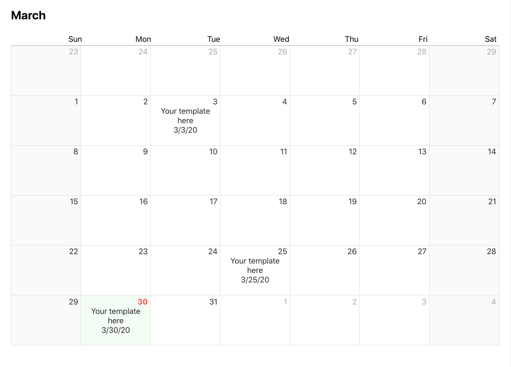

# react-month-view

`react-month-view` is a minimalistic React component that takes an array of data and displays it on a calendar month, allowing the specification of a custom template for each day.



## Basic Usage

```
<MonthView month={Moment|Date|String} data={Array} render={Function} />;
 ```
 ## Installation
 ```
 npm install react-month-view
 ```
 
### Props
| Name              | Required | Type                             | 
|-------------------|----------|----------------------------------|
| month             | no       | Moment \| Date \| String         | 
| data              | no       | Array                            | 
| render            | no       | Function                         |
| dateKey           | no       | String                           |

#### month
*month={Moment|Date|String)*
Specifies the month to be shown on the calendar. If not supplied the current month will be used.

#### data
*data={Array[Object]}*
The array of data to be shown on the calendar. Data will be mapped based on their date and exposed in the Day object of the render function.

#### render
*render={(Day) => template}*
A render function for displaying data in a custom template. 

#### dateKey
*dateKey={String}*
Should be supplied if your data uses another property other than 'date'. For example, if your data format is [{myDate: '12/2/2020', text: 'hello!'} set the `dateKey` prop to 'myDate'.

### Render Function

The `Day` object exposed by the render function will contain a property called `data`, which is an array of all data matched to that day. Use this as well as your own template to display the data.
```
const myRender = (day) => {
  return <span>{day.data[0]</span>
}
```
[Render Props](https://reactjs.org/docs/render-props.html)

## Examples

[Demo Project](https://github.com/rongg/month-view-demo)

## License
The project is licensed under The MIT License. See LICENSE.md for details.
